# YourEasySite - Diagram Architektury Systemu

## Przegląd Systemu

YourEasySite to wielodomenowa platforma SaaS do tworzenia osobistych stron internetowych, zbudowana w architekturze **Single Backend - Multiple Frontends**.

---

## Diagram Architektury Wysokiego Poziomu

```mermaid
---
title: Architektura Wysokiego Poziomu
---
graph TB
    subgraph "Użytkownicy"
        ADMIN[👤 Admini<br/>Deweloperzy]
        CREATOR[👤 Twórcy<br/>Właściciele Stron]
        CLIENT[👤 Klienci<br/>Użytkownicy Stron]
    end

    subgraph "Frontend Layer"
        STUDIO[🎨 Studio Frontend<br/>React SPA<br/>Port 3000]
        SITE[🌐 Osobiste Strony<br/>Statyczne Buildy<br/>Vercel]
    end

    subgraph "Backend Layer"
        DJANGO[⚙️ Django Backend<br/>REST API + WebSockets<br/>Port 8000]
        CELERY[⏰ Celery Worker<br/>Async Tasks]
        BEAT[📅 Celery Beat<br/>Scheduled Tasks]
    end

    subgraph "Data Layer"
        POSTGRES[(🗄️ PostgreSQL<br/>Port 5432)]
        REDIS[(💾 Redis<br/>Port 6379)]
        SUPABASE[☁️ Supabase Storage<br/>Media Files]
    end

    subgraph "External Services"
        GOOGLE[🔐 Google OAuth]
        P24[💳 Przelewy24<br/>Payments]
        OVH[🌍 OVH API<br/>Domain Management]
        CF[⚡ Cloudflare<br/>DNS + Worker]
        OPENAI[🤖 OpenAI API<br/>AI Assistant]
    end

    ADMIN --> STUDIO
    CREATOR --> STUDIO
    CLIENT --> SITE
    
    STUDIO --> DJANGO
    SITE --> DJANGO
    
    DJANGO --> POSTGRES
    DJANGO --> REDIS
    DJANGO --> SUPABASE
    
    CELERY --> REDIS
    CELERY --> POSTGRES
    BEAT --> REDIS
    
    DJANGO --> GOOGLE
    DJANGO --> P24
    DJANGO --> OVH
    DJANGO --> CF
    DJANGO --> OPENAI

    style STUDIO fill:#e1bee7
    style SITE fill:#c5e1a5
    style DJANGO fill:#90caf9
    style POSTGRES fill:#ffcc80
    style REDIS fill:#ef9a9a
```



---

## Szczegółowa Architektura Backend


---

## Modele Bazy Danych


---

## Architektura Frontend - Studio


---

## Przepływ Danych - Editor


---

## Przepływ Rezerwacji - Kalendarz

```mermaid
---
title: Booking Flow - Calendar
---
sequenceDiagram
    participant C as Klient (Guest)
    participant PS as Public Site
    participant API as Django API
    participant DB as PostgreSQL
    participant Email as Email Service

    C->>PS: Otwiera Kalendarz
    PS->>API: GET /public-sites/{id}/availability/
    API->>DB: Query Events & AvailabilityBlocks
    DB-->>API: Available Slots
    API-->>PS: Dostępne Terminy
    PS-->>C: Wyświetla Kalendarz

    C->>PS: Wybiera slot + wypełnia formularz
    PS->>API: POST /public-sites/{id}/bookings/
    API->>DB: CREATE Booking + Event
    DB-->>API: Booking Created
    
    API->>Email: Wyślij potwierdzenie
    Email-->>C: Email potwierdzenia
    API->>Email: Notify Creator
    Email-->>Creator: Powiadomienie o rezerwacji
    
    API-->>PS: Booking Success
    PS-->>C: Potwierdzenie + Link do anulowania
```



---

## Integracje Zewnętrzne


---

## Struktura URL API

```mermaid
---
title: API URL Structure
---
graph TB
    ROOT[/api/v1/]
    
    ROOT --> AUTH[/auth/*<br/>Login, Register, OAuth]
    ROOT --> USERS[/users/<br/>PlatformUser CRUD]
    ROOT --> SITES[/sites/<br/>Site CRUD]
    ROOT --> EVENTS[/events/<br/>Event CRUD]
    ROOT --> BOOKINGS[/bookings/<br/>Booking CRUD]
    ROOT --> CLIENTS[/clients/<br/>Client CRUD]
    ROOT --> TEAM[/team-members/<br/>Team Management]
    ROOT --> AVAILABILITY[/availability-blocks/<br/>Availability CRUD]
    ROOT --> TEMPLATES[/templates/<br/>Calendar Templates]
    ROOT --> COMPONENTS[/custom-components/<br/>React Components]
    ROOT --> MEDIA[/upload/<br/>Media Upload]
    ROOT --> NOTIFICATIONS[/notifications/<br/>User Notifications]
    ROOT --> TERMS[/terms/*<br/>Terms of Service]
    ROOT --> EMAIL[/emails/*<br/>Email Templates]
    ROOT --> DOMAINS[/domains/*<br/>Domain Management]
    ROOT --> PAYMENTS[/payments/*<br/>Przelewy24]
    ROOT --> NEWSLETTER[/newsletter/*<br/>Newsletter Management]
    ROOT --> TESTIMONIALS[/testimonials/<br/>Testimonials CRUD]
    ROOT --> AI[/ai-task/<br/>AI Assistant]
    ROOT --> PUBLIC[/public-sites/*<br/>Public API for Sites]
    ROOT --> ADMIN[/admin/*<br/>Admin Panel]

    style AUTH fill:#f8bbd0
    style PUBLIC fill:#c5e1a5
    style AI fill:#ce93d8
    style PAYMENTS fill:#ffccbc
```

---

## Przepływ Deploymentu


---

## Konteneryzacja (Docker Compose)


---

## Typy Użytkowników i Uprawnienia

```mermaid
---
title: User Types and Permissions
---
graph TB
    subgraph "Hierarchia Użytkowników"
        ADMIN[👨‍💼 Admin<br/>is_staff=True<br/>account_type=PRO]
        CREATOR[👤 Creator - Platform User<br/>Free / Pro / Pro+]
        TEAM[👥 Team Member<br/>Linked to Site]
        CLIENT[🙋 Client<br/>End User]
        GUEST[👻 Guest<br/>No Account]
    end

    subgraph "Uprawnienia Creator"
        C_OWN[Zarządza swoimi Sites]
        C_EDIT[Edytuje template_config]
        C_CALENDAR[Tworzy Events]
        C_TEAM[Zarządza Team Members]
        C_DOMAIN[Kupuje domeny]
        C_PAYMENT[Płaci za subskrypcje]
    end

    subgraph "Uprawnienia Team Member"
        T_CALENDAR[Zarządza własnymi Events]
        T_EDIT[Edytuje Site (role-based)]
        T_VIEW[Przegląda kalendarz]
    end

    subgraph "Uprawnienia Client"
        CL_BOOK[Rezerwuje group sessions]
        CL_VIEW[Przegląda historię rezerwacji]
        CL_CANCEL[Anuluje rezerwacje]
    end

    subgraph "Uprawnienia Guest"
        G_BOOK[Rezerwuje individual sessions]
        G_UPGRADE[Może utworzyć konto]
    end

    ADMIN --> C_OWN
    CREATOR --> C_OWN
    CREATOR --> C_EDIT
    CREATOR --> C_CALENDAR
    CREATOR --> C_TEAM
    CREATOR --> C_DOMAIN
    CREATOR --> C_PAYMENT
    
    TEAM --> T_CALENDAR
    TEAM --> T_EDIT
    TEAM --> T_VIEW
    
    CLIENT --> CL_BOOK
    CLIENT --> CL_VIEW
    CLIENT --> CL_CANCEL
    
    GUEST --> G_BOOK
    GUEST --> G_UPGRADE

    style ADMIN fill:#f44336
    style CREATOR fill:#2196f3
    style TEAM fill:#4caf50
    style CLIENT fill:#ff9800
    style GUEST fill:#9e9e9e
```

---

## Konwencje ID i Dane Mockowe


---

## Roadmap Funkcji


---

## Podsumowanie Technologii

| Warstwa | Technologia | Opis |
|---------|-------------|------|
| **Frontend** | React 18 + Vite | Single Page Application |
| **Routing** | React Router v6 | Client-side routing |
| **State Management** | Zustand | Lightweight state management |
| **Styling** | Tailwind CSS | Utility-first CSS |
| **Backend** | Django 5.1 + DRF | REST API |
| **WebSockets** | Django Channels + Daphne | Real-time communication |
| **Database** | PostgreSQL 16 | Relational database |
| **Cache/Queue** | Redis 7 | Message broker |
| **Async Tasks** | Celery | Background job processing |
| **File Storage** | Supabase Storage | Media assets |
| **Authentication** | Google OAuth 2.0 | Social login |
| **Payments** | Przelewy24 | Polish payment gateway |
| **Domain Management** | OVH API + Cloudflare | Domain purchase & DNS |
| **AI** | OpenAI GPT-4 | AI Assistant |
| **Email** | SMTP + Django Templates | Transactional emails |
| **Containerization** | Docker + Docker Compose | Development environment |
| **Hosting (Backend)** | Railway | PaaS for Django |
| **Hosting (Frontend)** | Vercel | Static site hosting |

---

## Bezpieczeństwo i Najlepsze Praktyki

- **Multi-tenancy**: Wszystkie zapytania filtrowane po `site_id`
- **Permissions**: Role-based access control (Owner, Manager, Contributor, Viewer)
- **Authentication**: OAuth2 + Magic Links + Password Reset
- **Data Isolation**: Każdy Site ma oddzielne dane
- **Media Storage**: Pliki hashowane (SHA-256) i deduplikowane
- **Rate Limiting**: Ochrona API przed nadużyciami
- **CORS**: Konfiguracja dla wielu domen
- **Environment Variables**: Wrażliwe dane w `.env`
- **Migrations**: Wszystkie zmiany DB przez Django migrations
- **Health Checks**: Docker healthchecks dla DB i Redis
- **Error Handling**: Globalne middleware dla błędów
- **Logging**: Structured logging dla debugging

---

**Wersja dokumentu**: 1.0  
**Data aktualizacji**: 21 listopada 2025  
**Autor**: YourEasySite Development Team
